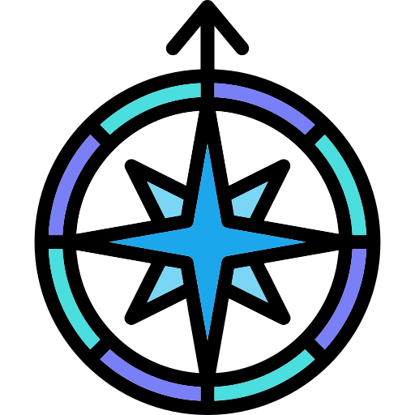
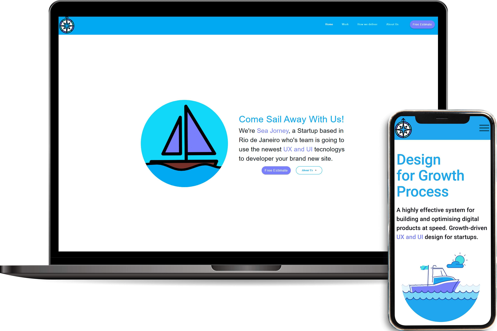

<h1 align="center">
    
</h1>

  <a href="#-technology">Technology</a>&nbsp;&nbsp;&nbsp;|&nbsp;&nbsp;&nbsp;
  <a href="#-project">Project</a>&nbsp;&nbsp;&nbsp;|&nbsp;&nbsp;&nbsp;
   <a href="#-site">Site</a>&nbsp;&nbsp;&nbsp;|&nbsp;&nbsp;&nbsp;

 

  

## 🚀 Technology

This project was developed with the following technologies:

-   [React](https://reactjs.org)
-   [Material-UI](https://material-ui.com/)
-   [Lottie](https://lottiefiles.com/)

## 💻 Project

Sea Journey is a fictional company that uses UX and UI to create modern websites for their clients 🌊

## ⛵ Site

In the link below you will find the complete responsive website.

-   [Sea Jorney](https://sea-jorney.vercel.app/)
